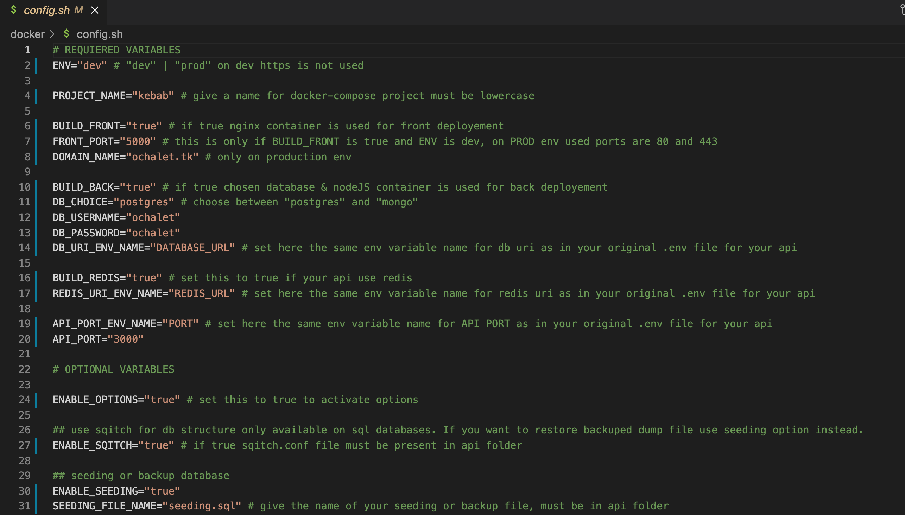

# Automated API/FRONTEND Deployment With Docker

<div id="top"></div>



<!-- ABOUT THE PROJECT -->
## About The Project

This is a personnal project, I made this for learning __bash scripting__ and have deeper knowledges with __[docker](https://docs.docker.com/get-docker/)__. And also for my personal usage for deployement.

I wanted to be able to deploy quickly and securly any API or frontend with simple conf file. 

This is thinked for __[nodeJS](https://nodejs.org/en/)__ backend and __[postgresql](https://www.postgresql.org/)__ or __[mongodb](https://www.mongodb.com/fr-fr)__ database and optionnaly with __[redis](https://redis.io/)__ database for caching. 

I also add optionnal modules
* ``sqitch`` if you want to deploy fresh relational database without any data but ready structure
* ``seeding`` if you aldreay have an backup file of your database
* ``scheduled backups`` with cron
* send over ``ssh`` your backups to another sever (using ``rsync``)

It's my first bash script, so it's not perfect at all ! 


### Built With

|[Docker](https://www.docker.com/) |[Bash]()|[MongoDB](https://www.docker.com/)|[NodeJS](https://nodejs.org/en/)|
|-|-|-|-|
|[ExpressJS](https://expressjs.com/fr/)|[MongoDB](https://www.mongodb.com/fr-fr)|[MongoDB](https://www.docker.com/)|[Postgresql](https://www.postgresql.org/)|
|[Sqitch](https://sqitch.org/)||||

### Tested on

- ubuntu 21.04
- debian 10
- macos BigSur (you need to have homebrew installed to be able to install [coreutils](https://formulae.brew.sh/formula/coreutils) and [gnu_sed](https://formulae.brew.sh/formula/gnu-sed))

I also test on cloud with debian 10 vm with [linode](https://www.linode.com/)

<!-- GETTING STARTED -->
## Getting Started
### Prerequisites

* [docker](https://docs.docker.com/get-docker/)
  ```sh
  $ curl -fsSL https://get.docker.com -o get-docker.sh
  $ sudo sh get-docker.sh
  $ sudo usermod -aG docker ${USER}
  $ sudo systemctl enable docker
  ```
* [docker-compose](https://dev.to/elalemanyo/how-to-install-docker-and-docker-compose-on-raspberry-pi-1mo)
  ```sh
  $ sudo apt-get install libffi-dev libssl-dev
  $ sudo apt install python3-dev
  $ sudo apt-get install -y python3 python3-pip
  $ sudo pip3 install docker-compose
  ```
* api files/folder must be in `automated-docker-deployment/api` folder
* frontend build files must be in `automated-docker-deploymentfront/build` folder

### Installation

1. Populate [config.sh](docker/config.sh) file, there is a lot of comments in this file for help
2. Be in `automated-docker-deployment/docker` folder and type
  ```sh
  bash automated-docker-deploy.sh
  ```
or 
  ```sh
  sudo bash automated-docker-deploy.sh
  ``` 
in case of your docker installation need `sudo`


<!-- ROADMAP -->
## Roadmap

- [x] Setup main script
- [x] Have separation of concerns (with separated conf file)
- [x] Add sqitch module
- [x] Add seeding module
- [x] Add backup module
- [x] Add ssh module

See the [open issues](https://github.com/jerome-karabenli/automated-docker-deployement/issues) for a full list of proposed features (and known issues).


<!-- CONTRIBUTING -->
## Contributing

Contributions are what make the open source community such an amazing place to learn, inspire, and create. Any contributions you make are **greatly appreciated**.

If you have a suggestion that would make this better, please fork the repo and create a pull request. You can also simply open an issue with the tag "enhancement".
Don't forget to give the project a star! Thanks again!

1. Fork the Project
2. Create your Feature Branch (`git checkout -b feature/AmazingFeature`)
3. Commit your Changes (`git commit -m 'Add some AmazingFeature'`)
4. Push to the Branch (`git push origin feature/AmazingFeature`)
5. Open a Pull Request


<!-- LICENSE -->
## License

Distributed under the MIT License. See `LICENSE.txt` for more information.


<!-- CONTACT -->
## Contact

Jerome Karabenli - jkarabenli.dev@gmail.com

Project Link: [https://github.com/jerome-karabenli/automated-docker-deployement](https://github.com/jerome-karabenli/automated-docker-deployement)


<!-- ACKNOWLEDGMENTS -->
## Acknowledgments

* [sed](https://www.cyberciti.biz/faq/how-to-use-sed-to-find-and-replace-text-in-files-in-linux-unix-shell/)
* [awk](https://www.howtogeek.com/562941/how-to-use-the-awk-command-on-linux/)
* [grep](https://www.cyberciti.biz/faq/howto-use-grep-command-in-linux-unix/)


## Infos
Just be careful with __`.dockerignore`__ file, not forgot to adapt it for your usage.

